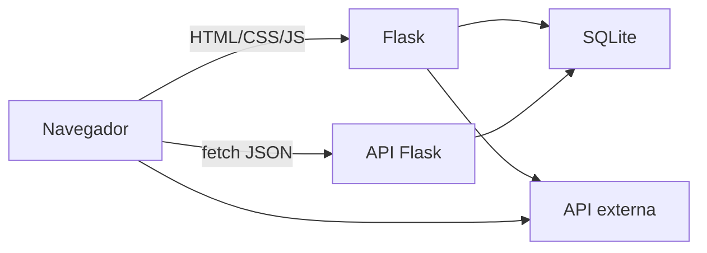
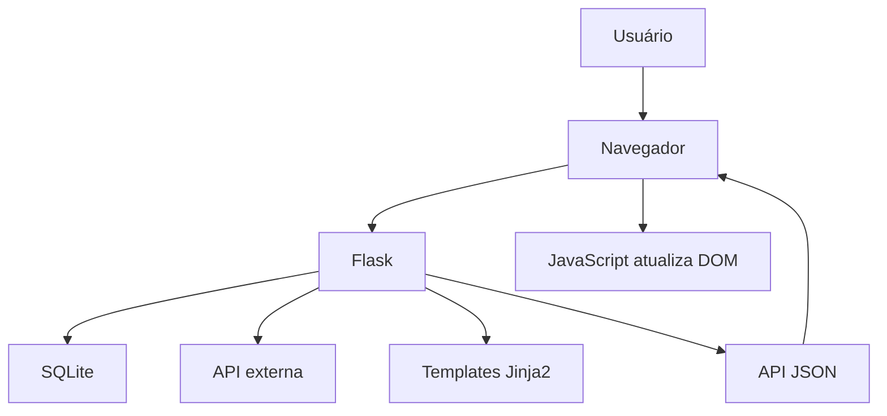

# Guia do Projeto Integrador  
## Curso Full Stack Python — Trabalho Final

Este material resume o que já foi visto no curso e transforma os requisitos do trabalho final em ações práticas. A ideia central é:

> **Uma aplicação simples, completa, documentada e funcionando vale mais do que uma arquitetura sofisticada que não roda.**

---

## 1. Objetivo do trabalho

Desenvolver uma aplicação web completa usando:

- **HTML semântico**
- **CSS Grid responsivo**
- **JavaScript vanilla**
- **Flask**
- **banco de dados relacional**
- **Git/GitHub com colaboração real**
- **testes**
- **documentação**
- **publicação no GitHub Pages**

A aplicação deve ser funcional do início ao fim:

```text
Usuário acessa o frontend
        ↓
Frontend consome backend via HTML e API JSON
        ↓
Flask processa regras de negócio
        ↓
Banco de dados persiste informações
        ↓
Eventualmente, uma API externa é consumida
        ↓
Relatórios podem ser exportados
```

# 3. Arquitetura recomendada

## 3.1 Estrutura de pastas de exemplo

```text
projeto_final/
│
├── .gitignore
├── requirements.txt
├── README.md
│
├── docs/
│   └── index.html              # Página do GitHub Pages
│
├── tests/
│   ├── test_regras.py
│   └── test_rotas.py
│
├── app/
│   ├── __init__.py             # Application Factory
│   ├── db.py                   # Conexão com SQLite
│   ├── modelos.py              # Classes Python
│   ├── servicos.py             # Regras de negócio
│   ├── auth.py                 # Blueprint de autenticação
│   ├── core.py                 # Blueprint principal/páginas
│   ├── api.py                  # Blueprint da API JSON
│   ├── schema.sql              # Script do banco
│   │
│   ├── templates/
│   │   ├── base.html
│   │   ├── errors/
│   │   │   ├── 404.html
│   │   │   └── 500.html
│   │   ├── auth/
│   │   │   ├── login.html
│   │   │   └── register.html
│   │   ├── core/
│   │   │   ├── dashboard.html
│   │   │   ├── tarefas.html
│   │   │   ├── export.html
│   │   │   └── mobile.html
│   │
│   └── static/
│       ├── css/
│       │   └── style.css
│       └── js/
│           └── app.js
│
├── seed.py                     # Dados de exemplo
└── instance/
    └── app.db                  # Banco SQLite local
```

---

## 3.2 Padrão arquitetural

O projeto pode seguir um padrão simples, próximo de um MVC/Flask tradicional:

| Camada | Responsabilidade | Exemplo no projeto |
|---|---|---|
| Apresentação | HTML, CSS, JS | Templates Jinja2, static |
| Rotas | Receber requisições e devolver respostas | Blueprints `core`, `auth`, `api` |
| Serviço | Regras de negócio | Classes em `servicos.py` |
| Persistência | Acesso ao banco | `db.py`, queries parametrizadas |

---

# 4. Checklist geral do trabalho final

Use esta tabela como visão rápida.

| Área | Requisito | Status |
|---|---|---|
| Frontend | HTML semântico | ☐ |
| Frontend | CSS Grid | ☐ |
| Frontend | Layout responsivo | ☐ |
| Frontend | Pelo menos uma visão otimizada para desktop | ☐ |
| Frontend | Pelo menos uma visão otimizada para mobile | ☐ |
| Frontend | JS vanilla | ☐ |
| Frontend | Consumo de API JSON com `fetch()` | ☐ |
| Frontend | Acessibilidade básica | ☐ |
| Banco | SQLite, PostgreSQL ou MariaDB | ☐ |
| Banco | Chaves estrangeiras | ☐ |
| Banco | CRUD completo | ☐ |
| Banco | Proteção contra SQL Injection | ☐ |
| Banco | `schema.sql` | ☐ |
| Banco | `seed.py` | ☐ |
| Backend | Flask | ☐ |
| Backend | `venv` | ☐ |
| Backend | `requirements.txt` | ☐ |
| Backend | Templates Jinja2 | ☐ |
| Backend | Erros 404 e 500 personalizados | ☐ |
| Backend | Pelo menos uma classe Python significativa | ☐ |
| Backend | Exportação HTML standalone | ☐ |
| Backend | Login/logout com hash de senha | ☐ |
| Backend | Consumo de API externa | ☐ |
| Git | Repositório público | ☐ |
| Git | PRs de todos os membros | ☐ |
| Git | Reviews aprovados antes do merge | ☐ |
| Git | Credenciais de teste no README, se necessário | ☐ |
| Qualidade | Pelo menos 3 testes úteis | ☐ |
| Qualidade | Diagrama da arquitetura/fluxo de dados | ☐ |
| Documentação | README completo | ☐ |
| Documentação | GitHub Pages | ☐ |

---

# 5. Requisito por requisito: como implementar

A seguir, alguns requisitos obrigatórios traduzidos em implementação prática.

---

## 5.1 Frontend

### HTML semântico

Use corretamente:

```html
<header>
<nav>
<main>
<section>
<article>
<aside>
<footer>
<form>
<label>
<button>
```

Evite:

```html
<div onclick="...">
<div class="botao">
<div class="titulo">
```

quando puder usar:

```html
<button>
<h1>
```

---

### CSS Grid

Use Grid para estruturar a página.

Exemplo simples:

```css
.layout {
  display: grid;
  grid-template-columns: 1fr;
  gap: 16px;
  max-width: 1200px;
  margin: 0 auto;
  padding: 16px;
}

@media screen and (min-width: 768px) {
  .layout {
    grid-template-columns: 280px 1fr;
  }
}
```

Para o dashboard:

```css
.dashboard {
  display: grid;
  grid-template-columns: repeat(auto-fit, minmax(220px, 1fr));
  gap: 16px;
}
```

---

### Responsividade

O projeto precisa ter:

- pelo menos uma experiência boa para desktop;
- pelo menos uma experiência boa para celular.

Isso pode ser feito de duas formas:

#### Opção 1: mesma página responsiva

A mesma rota `/` se adapta:

```css
@media screen and (max-width: 640px) {
  .esconder-mobile {
    display: none;
  }

  .lista-tarefas {
    grid-template-columns: 1fr;
  }
}
```

#### Opção 2: páginas separadas

Exemplo:

```text
/                → dashboard desktop
/mobile          → interface simplificada para celular
```

Se escolher páginas separadas, deixe claro no README.

---

### Se vocês travarem no `fetch()`

Sintoma comum: a API funciona no navegador, mas o JS não atualiza a página.

Checklist de depuração:

- [ ] O endpoint retorna **JSON de verdade** (use `jsonify` ou retorne um `dict`)?
- [ ] No JS, vocês encadearam `.then(resp => resp.json())` **antes** de usar os dados?
- [ ] O elemento que recebe os dados existe no HTML e o `id` bate com o `getElementById`?
- [ ] O script carrega **depois** do DOM (use `defer` no `<script>`)?
- [ ] Abrindo o DevTools → aba **Console**, há erro em vermelho?
- [ ] Na aba **Rede/Network**, a requisição `fetch` retorna 200 ou dá erro (ex.: 404/500)?

### Atualizar sem recarregar

O requisito é que alguma parte da página mude **sem reload**. Formas simples de demonstrar:

- filtrar uma lista ao mudar um `<select>`;
- buscar dados ao clicar em um botão;
- enviar um cadastro via `fetch` POST e atualizar a lista com a resposta.

Se ao clicar o navegador recarrega a página, provavelmente o botão está como `submit` dentro de um `<form>` sem `event.preventDefault()`, ou o link está navegando. Verifiquem isso.

### Acessibilidade

A aplicação deve passar em uma verificação básica de acessibilidade.

Checklist mínimo:

- todo campo de formulário possui `<label>` associado;
- imagens informativas possuem `alt`;
- contraste suficiente entre texto e fundo;
- apenas um `<h1>` por página;
- hierarquia de títulos sem saltos;
- elementos interativos alcançáveis por teclado;
- foco visível;

Exemplo:

```html
<label for="titulo">Título</label>
<input type="text" id="titulo" name="titulo" required>
```

Evite:

```html
<input type="text" placeholder="Digite o título">
```

sem label.

---

## 5.2 Banco de dados

### Schema com chaves estrangeiras

Exemplo de `schema.sql`:

```sql
DROP TABLE IF EXISTS tarefa;
DROP TABLE IF EXISTS categoria;
DROP TABLE IF EXISTS usuario;

CREATE TABLE usuario (
    id INTEGER PRIMARY KEY AUTOINCREMENT,
    username TEXT UNIQUE NOT NULL,
    password_hash TEXT NOT NULL
);

CREATE TABLE categoria (
    id INTEGER PRIMARY KEY AUTOINCREMENT,
    nome TEXT NOT NULL
);

CREATE TABLE tarefa (
    id INTEGER PRIMARY KEY AUTOINCREMENT,
    usuario_id INTEGER NOT NULL,
    categoria_id INTEGER,
    titulo TEXT NOT NULL,
    descricao TEXT,
    status TEXT NOT NULL DEFAULT 'pendente',
    criada_em TIMESTAMP NOT NULL DEFAULT CURRENT_TIMESTAMP,
    FOREIGN KEY (usuario_id) REFERENCES usuario(id),
    FOREIGN KEY (categoria_id) REFERENCES categoria(id)
);
```

No SQLite, lembre-se de ativar chaves estrangeiras por conexão:

```python
conexao.execute("PRAGMA foreign_keys = ON")
```

No Flask:

```python
g.db.execute("PRAGMA foreign_keys = ON")
```

---

### Segurança contra SQL Injection

Nunca faça:

```python
query = f"SELECT * FROM usuario WHERE username = '{username}'"
```

Faça:

```python
usuario = db.execute(
    "SELECT * FROM usuario WHERE username = ?",
    (username,)
).fetchone()
```

No PostgreSQL, o placeholder seria `%s`, mas no SQLite é `?`.

---

### Script de schema dedicado

O projeto deve ter algo como:

```text
app/schema.sql
```

ou:

```text
database/schema.sql
```

O importante é que o avaliador consiga recriar o banco facilmente.

---

### Script de seed

Crie um arquivo `seed.py`.

Exemplo simples:

```python
import sqlite3
from werkzeug.security import generate_password_hash

conexao = sqlite3.connect("instance/app.db")
conexao.execute("PRAGMA foreign_keys = ON")

with conexao:
    conexao.execute(
        "INSERT INTO usuario (username, password_hash) VALUES (?, ?)",
        ("admin", generate_password_hash("123456"))
    )

    conexao.execute(
        "INSERT INTO categoria (nome) VALUES (?)",
        ("Estudos",)
    )

    conexao.execute(
        "INSERT INTO categoria (nome) VALUES (?)",
        ("Trabalho",)
    )

    conexao.execute(
        """
        INSERT INTO tarefa (usuario_id, categoria_id, titulo, descricao, status)
        VALUES (?, ?, ?, ?, ?)
        """,
        (1, 1, "Estudar Flask", "Revisar blueprints e templates", "pendente")
    )

conexao.close()

print("Banco preenchido com dados de exemplo.")
```

No README, informe:

```bash
python seed.py
```

Se houver usuário de teste, informe:

```text
Usuário: admin
Senha: 123456
```

---

## 5.3 Backend Flask

### Ambiente virtual

Comandos recomendados:

```bash
python -m venv .venv
```

Windows:

```bash
.venv\Scripts\activate
```

Linux/macOS:

```bash
source .venv/bin/activate
```

Instalar dependências:

```bash
pip install flask requests pytest
```

Gerar `requirements.txt`:

```bash
pip freeze > requirements.txt
```

---

### Application Factory

Exemplo resumido:

```python
import os
from flask import Flask

def create_app():
    app = Flask(__name__, instance_relative_config=True)

    app.config.from_mapping(
        SECRET_KEY=os.environ.get("SECRET_KEY", "dev-key-nao-usar-em-producao"),
        DATABASE=os.path.join(app.instance_path, "app.db"),
    )

    os.makedirs(app.instance_path, exist_ok=True)

    from . import db
    db.init_app(app)

    from . import auth
    app.register_blueprint(auth.bp)

    from . import core
    app.register_blueprint(core.bp)

    from . import api
    app.register_blueprint(api.bp, url_prefix="/api")

    return app
```

---

### Templates Jinja2

Use herança de templates.

`base.html`:

```html
<!DOCTYPE html>
<html lang="pt-BR">
<head>
  <meta charset="UTF-8">
  <meta name="viewport" content="width=device-width, initial-scale=1.0">
  <title>Projeto</title>
  <link rel="stylesheet" href="{{ url_for('static', filename='css/style.css') }}">
</head>
<body>
  <header>
    <nav>
      <a href="{{ url_for('core.dashboard') }}">Dashboard</a>
      <a href="{{ url_for('core.tarefas') }}">Tarefas</a>
    </nav>
  </header>

  <main>
    
  </main>

  <footer>
    <p>Projeto Integrador — Full Stack Python</p>
  </footer>

  
</body>
</html>
```

---

### Tratamento de erros HTTP

Implemente pelo menos:

```python
@app.errorhandler(404)
def erro_404(e):
    return render_template("errors/404.html"), 404

@app.errorhandler(500)
def erro_500(e):
    return render_template("errors/500.html"), 500
```

Dentro da factory, registre os handlers após criar o app.

---

### Ambiente virtual (Windows)

```powershell
python -m venv .venv
.venv\Scripts\activate
```

Se o PowerShell bloquear a ativação do ambiente, rode **uma vez**:

```powershell
Set-ExecutionPolicy -ExecutionPolicy RemoteSigned -Scope CurrentUser
```

Instalar dependências e gerar o `requirements.txt`:

```powershell
pip install flask requests pytest
pip freeze > requirements.txt
```

Para sair do ambiente virtual:

```powershell
deactivate
```

### Programação Orientada a Objetos

O requisito pede **ao menos uma classe Python usada de forma significativa**. Como POO ainda **não foi estudado em aula**, este material não vai ensinar o conceito agora — ele será explicado em momento posterior do curso.

Orientações práticas:

- **Se você já implementou classes por conta própria** (modelos, serviços, dataclasses), ótimo: mantenha, e garanta que a classe é realmente usada no fluxo (não apenas definida).
- **Se ainda não sabe como fazer**, aguarde a explicação de POO e então introduza a classe. Uma forma comum de cumprir o requisito é transformar uma entidade do seu banco (ex: `Tarefa`, `Produto`, `Pet`, `Ocorrencia`) em uma classe com atributos e alguns métodos úteis (validar, converter para dicionário usado na API).
- **O que o avaliador observa:** uso significativo. A classe precisa aparecer no fluxo real (criação, validação ou serialização), não ficar “solta” no código.

### Exportação standalone

Requisito: um endpoint que gere um **arquivo HTML com dados e JS embutidos**, que funcione **offline** no navegador, sem servidor.

Este é um **desafio de integração**: vocês devem montar a solução combinando ferramentas que já conhecem. Não há solução pronta aqui — faz parte do trabalho construir.

**O que vocês já têm para resolver:**
- Jinja2 e `render_template` para gerar HTML a partir de dados do banco;
- consultas SQL para obter os dados que vão no relatório;
- o conhecimento de HTML/CSS/JS do front-end.

**Perguntas para guiar (sem entregar a resposta):**
- Como fazer os dados do banco “viajarem” para dentro do HTML gerado, de modo que o arquivo final já contenha as informações, sem precisar de nova requisição?
- Como incluir um pequeno script JS no próprio arquivo para permitir filtrar/buscar localmente?
- Como fazer o navegador **baixar** o arquivo em vez de apenas exibir a página? (pesquisem sobre cabeçalhos de resposta e download)
- Como garantir que os dados fiquem em formato que o JS consiga ler dentro do HTML?

**Critério de aceite (teste você mesmo):** baixe o arquivo, **desligue o servidor** e abra o HTML direto no navegador. Os dados devem aparecer e a interação (ex.: filtrar) deve funcionar.

---

### Autenticação

Use sessão e hash de senha.

Nunca salve senha em texto plano.

Registro:

```python
from werkzeug.security import generate_password_hash

db.execute(
    "INSERT INTO usuario (username, password_hash) VALUES (?, ?)",
    (username, generate_password_hash(password))
)
```

Login:

```python
from werkzeug.security import check_password_hash

usuario = db.execute(
    "SELECT * FROM usuario WHERE username = ?",
    (username,)
).fetchone()

if usuario is None or not check_password_hash(usuario["password_hash"], password):
    flash("Usuário ou senha inválidos.", "error")
else:
    session.clear()
    session["user_id"] = usuario["id"]
```

Logout:

```python
session.clear()
```

Proteção de rotas:

```python
import functools
from flask import g, redirect, url_for, flash

def login_required(view):
    @functools.wraps(view)
    def wrapped_view(**kwargs):
        if g.user is None:
            flash("Você precisa estar logado.", "error")
            return redirect(url_for("auth.login"))

        return view(**kwargs)

    return wrapped_view
```

---

### Integração externa

Use uma API de terceiros.

Recomendações de APIs gratuitas e simples:

| API | Uso possível | Precisa de chave? |
|---|---|---|
| ViaCEP | preencher endereço pelo CEP | Não |
| IBGE Localidades | listar estados, municípios | Não |
| Open-Meteo | clima por latitude/longitude | Não |

Exemplo com `requests`:

```python
import requests

def buscar_cep(cep):
    url = f"https://viacep.com.br/ws/{cep}/json/"

    try:
        resposta = requests.get(url, timeout=5)
        resposta.raise_for_status()
        dados = resposta.json()

        if dados.get("erro"):
            return None

        return dados

    except requests.RequestException:
        return None
```

Trate erros:

```python
dados = buscar_cep("01001000")

if dados is None:
    flash("Não foi possível buscar o CEP.", "error")
else:
    cidade = dados.get("localidade")
```

---

## 5.4 Versionamento e colaboração

### Repositório público

O projeto deve estar público no GitHub.

---

### Pull Requests de todos os membros

Cada membro precisa ter contribuições visíveis.

Recomendação:

- cada pessoa cria uma branch;
- cada pessoa abre pull request;
- o mantenedor revisa e aprova;
- só depois faz merge.

Exemplo de branch:

```text
feature/login
feature/dashboard
feature/api-tarefas
feature/testes
docs/readme
```

---

### Reviews com aprovação manual

Não basta fazer push direto na `main`.

Usem PR com revisão.

Fluxo:

```text
1. Criar branch
2. Fazer alterações
3. Commitar
4. Push
5. Abrir Pull Request
6. Outro membro revisa
7. Mantenedor aprova
8. Merge
```

---

### Credenciais no README

Se houver usuário de teste, coloque no README:

```md
## Usuário de teste

- Usuário: admin
- Senha: 123456
```

Se usar API externa com chave, explique onde configurar.

Evite commitar chaves reais.

---

## 5.5 Arquitetura e qualidade

### Padrão de desenvolvimento

A equipe deve declarar no README qual padrão escolheu.

Exemplo:

> O projeto utiliza Flask com Application Factory, Blueprints e uma camada simples de serviços para regras de negócio.

---

### Testes unitários

Mínimo: **3 testes úteis**.

Eles devem testar lógica de negócio, não apenas “ver se o servidor responde 200”.

Boas ideias:

1. validar criação de tarefa;
2. testar cálculo ou regra de negócio;
3. testar permissão de acesso.

Exemplo de teste de validação:

```python
import pytest
from app.modelos import Tarefa


def test_tarefa_sem_titulo_invalida():
    tarefa = Tarefa(
        id=1,
        usuario_id=1,
        categoria_id=1,
        titulo="",
        descricao="Teste",
        status="pendente"
    )

    with pytest.raises(ValueError):
        tarefa.validar()
```

Exemplo de regra de negócio:

```python
def test_tarefa_pendente_pode_ser_concluida():
    tarefa = Tarefa(
        id=1,
        usuario_id=1,
        categoria_id=1,
        titulo="Estudar",
        descricao="Flask",
        status="pendente"
    )

    assert tarefa.pode_ser_concluida()
```

Exemplo de rota protegida:

```python
def test_exportacao_exige_login(client):
    resposta = client.get("/exportar")

    assert resposta.status_code == 302
```

Para rodar testes com pytest:

```bash
pytest
```

Se quiserem usar `unittest`, também é válido.

---

### Diagrama da arquitetura

A equipe pode fazer um diagrama simples.

Exemplo em Mermaid:



Ou um diagrama em imagem:

```text
Navegador
   ↓
Flask
   ↓
SQLite
   ↓
Serviços/Regras
   ↓
API externa
```

Pode ser feito em:

- draw.io;
- Excalidraw;
- Mermaid;
- PowerPoint;
- Canva.

---

## 5.6 Documentação

### README.md obrigatório

O README deve conter:

```md
# Nome do Projeto

Descrição curta do projeto.

## Funcionalidades

- Login e logout
- CRUD de tarefas
- Dashboard responsivo
- API JSON
- Exportação de relatório offline
- Consumo de API externa

## Tecnologias

- Python 3
- Flask
- SQLite
- HTML
- CSS Grid
- JavaScript vanilla
- Requests
- Pytest

## Como instalar

1. Clone o repositório:
   ```bash
   git clone https://github.com/usuario/projeto.git
   ```

2. Entre na pasta:
   ```bash
   cd projeto
   ```

3. Crie o ambiente virtual:
   ```bash
   python -m venv .venv
   ```

4. Ative o ambiente:
   - Windows:
     ```bash
     .venv\Scripts\activate
     ```
   - Linux/macOS:
     ```bash
     source .venv/bin/activate
     ```

5. Instale as dependências:
   ```bash
   pip install -r requirements.txt
   ```

6. Inicialize o banco:
   ```bash
   flask --app app init-db
   ```

7. Popule o banco com dados de exemplo:
   ```bash
   python seed.py
   ```

8. Rode a aplicação:
   ```bash
   flask --app app run --debug
   ```

9. Acesse:
   ```text
   http://127.0.0.1:5000
   ```

## Usuário de teste

- Usuário: admin
- Senha: 123456

## Arquitetura

O projeto usa Flask com Application Factory, Blueprints e camada de serviços.

## Divisão da equipe

| Nome | Responsabilidade |
|---|---|
| Ana | Backend e autenticação |
| Bruno | Frontend e CSS |
| Carla | Banco de dados e testes |
| Diego | API e JavaScript |

## Link do GitHub Pages

https://usuario.github.io/projeto/
```

---

### GitHub Pages

A equipe deve publicar uma página estática sobre o projeto.

Pode ser em:

```text
docs/index.html
```

Depois:

1. vá em **Settings**;
2. clique em **Pages**;
3. selecione a branch `main`;
4. selecione a pasta `/docs`;
5. salve.

A página deve ter:

- nome do projeto;
- descrição;
- screenshots;
- tecnologias;
- equipe;
- link para o repositório;
- instruções de execução.

Exemplo simples:

```html
<!DOCTYPE html>
<html lang="pt-BR">
<head>
  <meta charset="UTF-8">
  <meta name="viewport" content="width=device-width, initial-scale=1.0">
  <title>Projeto Integrador</title>

  <style>
    body {
      font-family: system-ui, sans-serif;
      margin: 0;
      background: #f9fafb;
      color: #1f2937;
    }

    header {
      background: #0d9488;
      color: white;
      padding: 2rem;
      text-align: center;
    }

    main {
      max-width: 900px;
      margin: 2rem auto;
      padding: 1rem;
      background: white;
      border-radius: 8px;
    }

    footer {
      text-align: center;
      padding: 2rem;
      color: #6b7280;
    }
  </style>
</head>
<body>
  <header>
    <h1>Sistema de Tarefas</h1>
    <p>Projeto Integrador Full Stack Python</p>
  </header>

  <main>
    <h2>Sobre o projeto</h2>
    <p>
      Aplicação web para gerenciamento de tarefas com autenticação,
      banco de dados SQLite, API JSON e exportação de relatórios.
    </p>

    <h2>Tecnologias</h2>
    <ul>
      <li>Flask</li>
      <li>SQLite</li>
      <li>JavaScript vanilla</li>
      <li>CSS Grid</li>
      <li>Pytest</li>
    </ul>

    <h2>Links</h2>
    <p>
      <a href="https://github.com/usuario/projeto">Repositório no GitHub</a>
    </p>
  </main>

  <footer>
    <p>Equipe: Ana, Bruno, Carla e Diego</p>
  </footer>
</body>
</html>
```

---

# 6. Roteiro recomendado de desenvolvimento

A equipe pode seguir esta ordem para evitar retrabalho.

---

## Etapa 1 — Organização inicial

- criar repositório;
- adicionar colaboradores;
- criar `.gitignore`;
- criar `README.md` inicial;
- definir escopo.

`.gitignore` recomendado:

```gitignore
.venv/
__pycache__/
*.pyc
instance/
.env
.vscode/
.idea/
```

# 7. Modelo de divisão de tarefas

A atividade é em **2 ou 3 alunos**. A divisão deve garantir que **todos tenham PRs aprovados**.

### Equipe de 2

| Membro | Fatia |
|---|---|
| Membro 1 | Fluxo principal A ponta a ponta (ex.: autenticação + CRUD da entidade principal + tela) |
| Membro 2 | Fluxo principal B ponta a ponta (ex.: API JSON + JS + exportação + documentação) |

Ambos revisam os PRs um do outro. O dono do repositório faz o merge após aprovação.

### Equipe de 3

| Membro | Fatia |
|---|---|
| Membro 1 | Banco + CRUD + autenticação |
| Membro 2 | Front-end (HTML/CSS Grid responsivo + acessibilidade) |
| Membro 3 | API JSON + JS + exportação standalone + testes |

> Evitem a armadilha de “um só faz o back e nunca mexe no front”. Cada um deve conseguir rodar e entender o projeto inteiro. Em equipe pequena, o risco de uma pessoa concentrar tudo é maior — e o requisito de **PRs de todos** deixa isso visível na avaliação.

---

# 8. Checklist técnico rápido

## Banco de dados

- [ ] Existe `schema.sql`.
- [ ] Existe `seed.py`.
- [ ] Há pelo menos duas tabelas relacionadas.
- [ ] Há chave estrangeira.
- [ ] CRUD funciona.
- [ ] Queries usam `?` ou `%s`.
- [ ] Não existe SQL montado com f-string.

---

## Flask

- [ ] Existe `requirements.txt`.
- [ ] Aplicação roda com `venv`.
- [ ] Usa Jinja2.
- [ ] Usa Blueprints ou organização equivalente.
- [ ] Possui tratamento 404.
- [ ] Possui tratamento 500.
- [ ] Possui pelo menos uma classe útil.
- [ ] Login funciona.
- [ ] Logout funciona.
- [ ] Senhas são armazenadas com hash.

---

## API e JavaScript

- [ ] Existe endpoint JSON.
- [ ] Frontend consome endpoint com `fetch()`.
- [ ] Alguma parte da página atualiza sem reload.
- [ ] Não usa framework frontend.
- [ ] Código JS está em arquivos separados.

---

## Frontend

- [ ] HTML semântico.
- [ ] CSS Grid usado.
- [ ] Layout responsivo.
- [ ] Experiência desktop adequada.
- [ ] Experiência mobile adequada.
- [ ] Acessibilidade básica atendida.

---

## Qualidade

- [ ] Três testes relevantes.
- [ ] Testes podem ser executados com comando simples.
- [ ] Diagrama da arquitetura presente.
- [ ] README explica como rodar.

---

## Git

- [ ] Repositório público.
- [ ] Todos os membros possuem PRs.
- [ ] PRs foram revisados.
- [ ] Merge foi feito após aprovação.
- [ ] Histórico não contém senhas ou chaves reais.

---

# 9. Erros comuns que devem ser evitados

## 1. Aplicação não roda

O avaliador precisa conseguir rodar com comandos simples.

Sempre testem em um clone limpo:

```bash
git clone ...
cd ...
python -m venv .venv
.venv\Scripts\activate
pip install -r requirements.txt
flask --app app run
```

---

## 2. Falta de `requirements.txt`

Não basta dizer “instale Flask”.

O `requirements.txt` deve listar as dependências.

---

## 3. Senha em texto plano

Nunca:

```python
password = "123456"
```

Use hash.

---

## 4. SQL Injection

Nunca:

```python
db.execute(f"SELECT * FROM usuario WHERE username = '{username}'")
```

Use:

```python
db.execute("SELECT * FROM usuario WHERE username = ?", (username,))
```

---

## 6. Frontend sem responsividade

Testem:

- tela grande;
- tela pequena;
- teclado;
- contraste.

---

## 7. Exportação que depende do servidor

O HTML exportado deve funcionar offline.

Se ele precisar de `/api/dados` para funcionar, não está correto.

---

## 8. Todos os commits feitos por uma única pessoa

Mesmo que uma pessoa programa mais, a equipe deve dividir trabalho via issues e PRs.

---

## 9. README incompleto

O README deve permitir que alguém rode o projeto sem perguntar nada.

---

# 10. Exemplo de fluxo de dados para o diagrama

A equipe pode usar este modelo como base:



---

# 11. Definição de pronto

Uma entrega está pronta quando:

- [ ] o código está no GitHub;
- [ ] o projeto roda localmente;
- [ ] o banco pode ser recriado;
- [ ] há dados de exemplo;
- [ ] login funciona;
- [ ] CRUD funciona;
- [ ] API JSON funciona;
- [ ] JavaScript consome a API;
- [ ] a interface é responsiva;
- [ ] há pelo menos três testes;
- [ ] o README está completo;
- [ ] o GitHub Pages está publicado;
- [ ] todos os membros têm PRs aprovados.

---

## 12. Projeto Final — Resumo

Vocês devem desenvolver uma aplicação web completa usando os conhecimentos do curso.

### Obrigatório

- HTML semântico;
- CSS Grid responsivo;
- JavaScript vanilla;
- consumo de API JSON com `fetch()`;
- Flask;
- banco relacional com chave estrangeira;
- CRUD;
- proteção contra SQL Injection;
- `schema.sql`;
- `seed.py`;
- login/logout com hash de senha;
- templates Jinja2;
- páginas de erro 404 e 500;
- pelo menos uma classe Python significativa;
- exportação HTML standalone;
- consumo de API externa;
- pelo menos 3 testes;
- README completo;
- GitHub Pages;
- PRs e reviews de todos os membros.

### Recomendação

Comecem simples:

```text
Login → CRUD → API JSON → Frontend → Testes → Documentação
```

Não tentem fazer uma arquitetura complexa antes do básico funcionar.

---

# 13. Sugestão de cronograma

Se o trabalho for desenvolvido em etapas:

| Etapa | Entrega |
|---|---|
| 1 | Escopo, equipe, repositório |
| 2 | Schema e seed |
| 3 | Flask rodando com templates |
| 4 | Autenticação |
| 5 | CRUD |
| 6 | API JSON + JavaScript |
| 7 | Frontend responsivo |
| 8 | API externa |
| 9 | Exportação standalone |
| 10 | Testes |
| 11 | README e GitHub Pages |
| 12 | Revisão final |

---

# 14. Perguntas frequentes

## A API externa precisa ser no backend?

Não necessariamente. Pode ser consumida no frontend com `fetch`, como ViaCEP ou IBGE.

---

## O export standalone precisa ser bonito?

Preferencialmente. Mas precisa ser pelo menos funcional. Deve abrir offline e permitir alguma interação simples com JavaScript, como filtro ou busca.

---

## O GitHub Pages vai executar a aplicação completa/Flask?

Não. GitHub Pages é estático. Ele deve apresentar o projeto:

- descrição;
- imagens;
- tecnologias;
- equipe;
- link para o repositório.
- exemplo de exportação offline.

